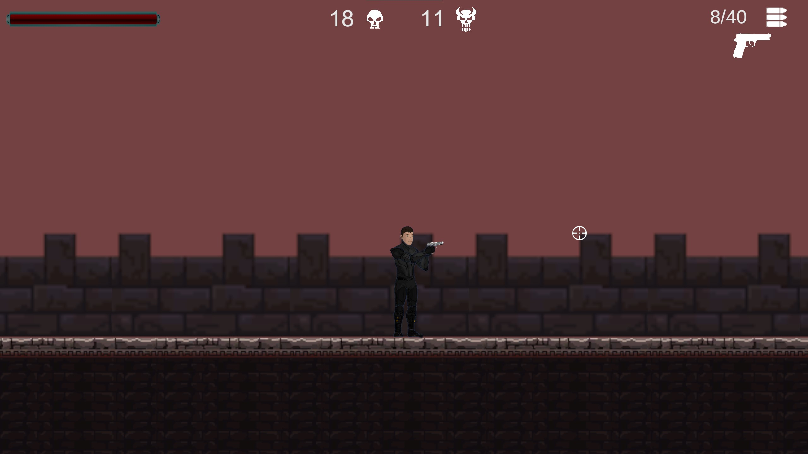
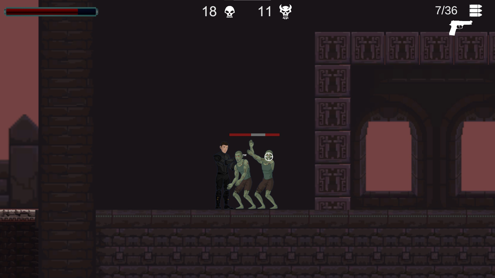

  <h1 align="center">Unity Lab Project</h1>

  

    The game was developed as a project from the subject "Game Design in Unity Environment".
     
    
  

 

## About the project

  This is a basic 2D shooter game created in Unity. Main objective is to defeat all enemies. 
  Player can use a simple pistol or find an assault rifle. The game includes one sample level with two types of enemies.

## Built with
[![Unity][Unity]][Unity-url] 
[![CSharp][CSharpLogo]][CSharp-url] 

[Unity]: https://img.shields.io/badge/Unity-100000?style=for-the-badge&logo=unity&logoColor=white
[Unity-url]: https://unity.com
[CSharpLogo]: https://img.shields.io/badge/C%23-239120?style=for-the-badge&logo=csharp&logoColor=white
[CSharp-url]: https://learn.microsoft.com/en-us/dotnet/csharp/

## Screenshots

  
  
  

